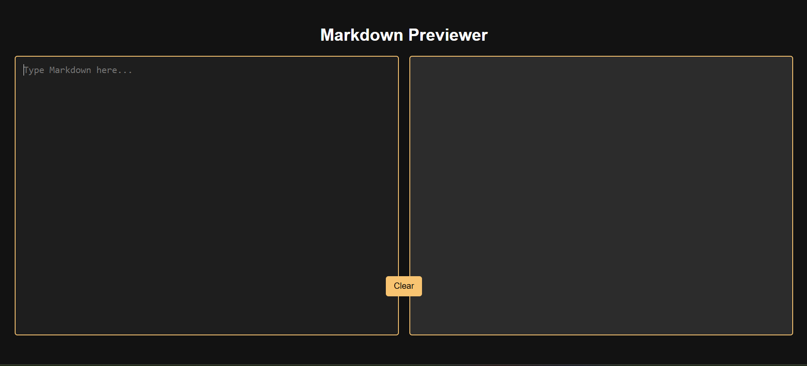

# 🚀 Markdown Previewer

A **live Markdown previewer** that converts Markdown syntax into formatted HTML in real time!  

## 🌟 Features
✅ **Live Markdown Preview** – Updates as you type  
✅ **Syntax Highlighting** – For inline & multi-line code blocks  
✅ **Basic Markdown Support** – Headers, bold, italics, lists, links, and blockquotes  
✅ **Dark Themed UI** – Visually appealing with a modern look  
✅ **Mobile Responsive** – Works across devices  
✅ **Clear Button** – Easily reset input  

## 🎨 Screenshots
  

🚀 Deployment
This project is hosted on Netlify.
🔗 Live Demo (https://mdandcodepreview.netlify.app/)